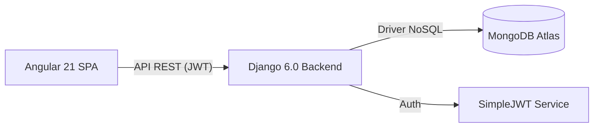

# 🍎 Libro de Clases Digital 2.0
> **Sistema Integral de Gestión Escolar SaaS: Transformando la administración académica con tecnología de vanguardia.**

Este proyecto nace con la visión de sustituir el libro de clases tradicional por una plataforma digital robusta, intuitiva y centralizada. Diseñado como un **MVP de grado empresarial**, permite a instituciones educativas gestionar la asistencia, evaluaciones, convivencia escolar y comunicación con apoderados en tiempo real.

---

## 💎 Propuesta de Valor
A diferencia de los registros físicos, este sistema ofrece:
- **Integridad de Datos**: Almacenamiento seguro en la nube (MongoDB Atlas).
- **Analítica en Tiempo Real**: Visualización inmediata del rendimiento y comportamiento estudiantil.
- **Omnicanalidad**: Acceso diferenciado para Administradores, Docentes y Apoderados desde cualquier dispositivo.
- **Automatización**: Generación de reportes y alertas automáticas basadas en indicadores críticos.

---

## 🚀 Características Destacadas

### 👤 Gestión de Usuarios y Seguridad
- **RBAC (Role-Based Access Control)**: Sistema de permisos granulares mediante JWT.
- **Dashboard Adaptativo**: La interfaz se reconfigura dinámicamente según el rol (Admin/Profesor/Apoderado).

### 📝 Libro de Clases Digital
- **Módulo de Asistencia**: Registro rápido y visual de presencias diarias por curso.
- **Bitácora de Convivencia (Anotaciones)**: Registro histórico de hitos conductuales con indicadores visuales de impacto (Positivas/Negativas).
- **Planificador de Evaluaciones**: Calendario interactivo para la gestión de calificaciones y fechas de exámenes.

### 📊 Panel del Alumno (SaaS Experience)
- **Visualización Estilo Bento**: Interfaz moderna que presenta el rendimiento académico, alertas de asistencia y próximas evaluaciones en un formato limpio y profesional.
- **Seguridad de Datos**: Acceso restringido a la información propia del alumno y su grupo familiar.

---

## 🛠️ Stack Tecnológico Premium

| Capa | Tecnología | Descripción |
| :--- | :--- | :--- |
| **Frontend** | **Angular 21 + Angular Material** | Arquitectura SPA reactiva con componentes de alto rendimiento. |
| **Backend** | **Django 6.0 + REST Framework** | API escalable con lógica de negocio desacoplada. |
| **Base de Datos** | **MongoDB Atlas** | Almacenamiento NoSQL flexible para documentos académicos complejos. |
| **Autenticación** | **SimpleJWT** | Tokens de seguridad de corta duración con rotación dinámica. |
| **Styling** | **Vanilla CSS + Glassmorphism** | Estética moderna con efectos de transparencia y micro-animaciones. |

---

## 🏗️ Arquitectura del Sistema
El proyecto sigue un patrón de **Desacoplamiento Total**, permitiendo que el Frontend y el Backend escalen de forma independiente.

---

## 📦 Instalación y Despliegue Local

### Requisitos Previos
- Python 3.10+
- Node.js 20+
- Cuenta en MongoDB Atlas (o instancia local)

### Configuración del Backend
1. Entrar al directorio: `cd backend`
2. Crear entorno virtual: `python -m venv venv`
3. Activar y cargar dependencias: `pip install -r requirements.txt`
4. Configurar variables en `.env`: `SECRET_KEY`, `MONGODB_PASSWORD`.
5. Iniciar: `python manage.py runserver`

### Configuración del Frontend
1. Entrar al directorio: `cd frontend/escolar-frontend`
2. Instalar dependencias: `npm install`
3. Iniciar entorno de desarrollo: `npm start`

---

## 👤 Autor
Desarrollado como parte de un portafolio profesional de Ingeniería de Software, enfocado en resolver problemas reales mediante el uso de tecnologías modernas de desarrollo web.
